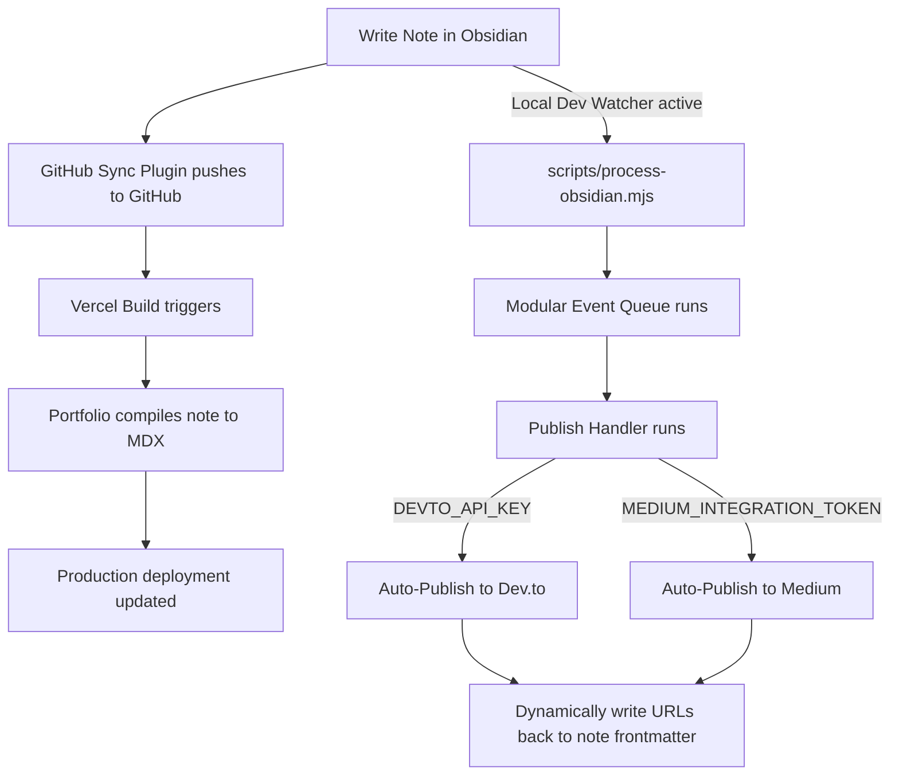

# Obsidian Auto-Publishing Sync & Queue Guide 🚀

Welcome to your fully automated, self-healing, multi-platform blogging pipeline! This guide explains how the system works, how to use it day-to-day, and how to retrieve and configure your credentials for **Dev.to** and **Medium** to move from Mock mode to live integration.

---

## 🏗️ System Architecture & Workflow

Here is how the automated publishing lifecycle works:



### Key Pillars:
1. **Decoupled CI/CD**: Production deployments (Vercel builds) only compile markdown to static pages. Outbound API publishing and file modifications are completely bypassed during build time (`process.env.VERCEL === "1"`), guaranteeing lightning-fast builds and zero double-posts.
2. **Local Queue Worker**: Asynchronous queue processing runs locally while you write (`npm run dev`). The worker handles publishing and modifies your note files immediately in your local directory. When you push, they are already populated.
3. **Dynamic Idempotency**: If one platform fails and the other succeeds, the worker updates the success URL in the frontmatter immediately. A retry ONLY attempts the failed platform, skipping the successful one.

---

## ✍️ How to Write & Publish a Note

To write a note and publish it across all platforms, simply create a standard `.md` file inside your Obsidian vault with the following required frontmatter parameters:

```yaml
---
title: "Mastering JavaScript Closures"
summary: "Understand closures, lexical scope, and memory encapsulation in JavaScript."
publish: true
tags:
  - javascript
  - webdev
  - programming
---
# Mastering JavaScript Closures

Your markdown note body goes here...
```

### Note Status Behaviors:
* **Drafts**: If `publish` is `false` or missing, the file is entirely ignored by the portfolio site and the queue.
* **Auto-Queue**: If `publish: true` is set, the local dev watcher instantly registers the note, compiles it to an `.mdx` page on your site, and queues a `blogPublish` task.
* **URLs Injected**: On successful publishing, the queue updates your Obsidian file frontmatter automatically:
  ```yaml
  devto_url: 'https://dev.to/0xadityaa/mastering-javascript-closures_123'
  medium_url: 'https://medium.com/@0xadityaa/mastering-javascript-closures_456'
  ```

---

## 🔑 Fetching & Configuring API Credentials

To perform live publishing on your real Dev.to and Medium accounts, follow these instructions to retrieve and configure your credentials.

### 1. Dev.to API Key
1. Log in to [Dev.to](https://dev.to).
2. Click your profile avatar in the top-right corner and select **Settings**.
3. In the left navigation sidebar, click on **Extensions**.
4. Scroll down to the **DEV Community API Keys** section.
5. Enter a description (e.g., `Portfolio Auto-Sync`) and click **Generate API Key**.
6. Copy the generated key.

---

### 2. Medium Integration Token
1. Log in to [Medium](https://medium.com).
2. Click your profile avatar in the bottom-left/top-right corner and click **Settings**.
3. In the settings page, navigate to the **Security and apps** tab.
4. Scroll down to the **Integration tokens** section.
5. Enter a description for your token (e.g., `Portfolio Auto-Sync`) and click **Get token**.
6. Copy the generated token.

---

## ⚙️ Project Configuration

### Step 1: Create Your `.env` File
Create a new file named `.env` (or `.env.local`) at the root of your `portfolio` project:

```bash
# Portfolio Event Queue Credentials
DEVTO_API_KEY=your_copied_devto_api_key
MEDIUM_INTEGRATION_TOKEN=your_copied_medium_integration_token
```

> [!NOTE]
> If these variables are not defined, or set to `"mock"`, the system automatically runs in **Mock Mode**, generating mock URLs for safe offline validation.

### Step 2: Push Vault Changes
1. Once you see the `devto_url` and `medium_url` populate in your Obsidian note frontmatter, use the **GitHub Sync** ribbon icon in your Obsidian sidebar to commit and push changes.
2. Vercel will rebuild the site in a few seconds, making your blog live on your portfolio!

---

## 🛠️ Extensibility: Adding Future Automations

The event-driven queue is fully modular. If you want to add future workflows (e.g., auto-scheduling a weekly Twitter/LinkedIn post), simply:
1. Create a new handler in `scripts/queue/handlers/<yourTopic>.mjs`.
2. Register it inside `scripts/process-obsidian.mjs`:
   ```javascript
   import { handleSocialShare } from "./queue/handlers/socialShare.mjs";
   queue.registerHandler("socialShare", handleSocialShare);
   ```
3. Queue the job using `queue.addJob("socialShare", payload)` and specify any scheduling parameters.
